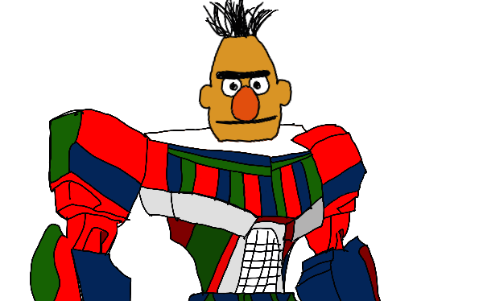
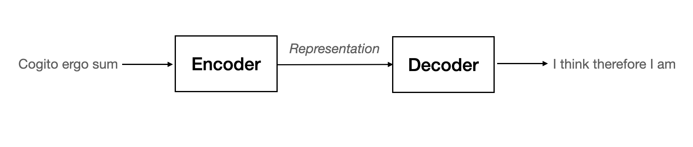
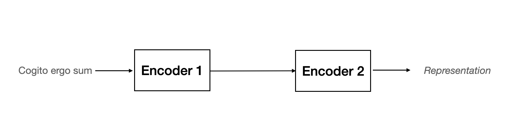
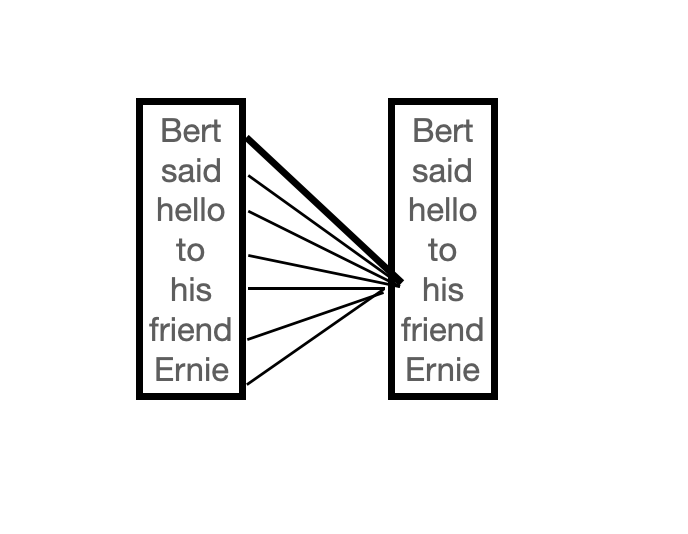
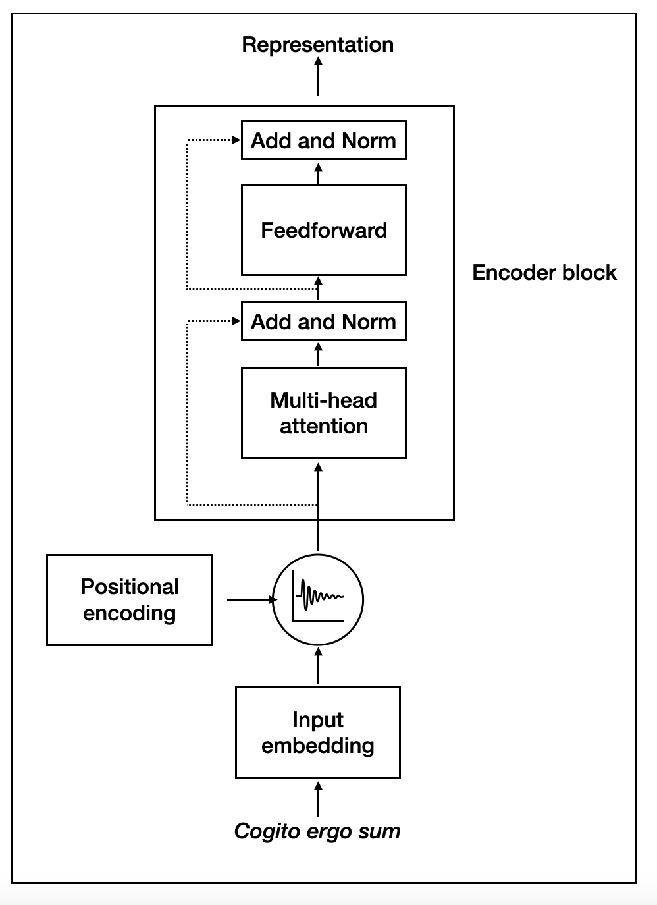
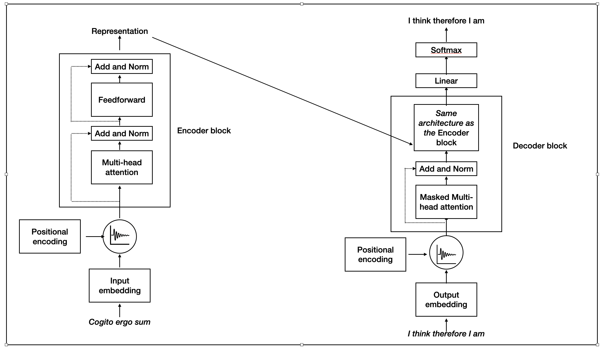

# An introduction to transformers

**Objectives**

*   To understand transformer architecture
*   To understand the encoder and decoder components of transformers

**BERT** is Google's **bidrectional encoder representations from transformers**. Bert is also half of the popular *Sesame Street* duo.
Below is [Bert as a Transformer](https://towardsdatascience.com/build-a-bert-sci-kit-transformer-59d60ddd54a5).

In order to understand how BERT works, we need to first look at what is meant by a transformer in the context of machine learning.

## Transformers

A transformer is a modification of a recurrent neural network, where we replace the recurrent part of the model with an "attention" mechanism. In particular, BERT uses one called *self-attention*.

The transformer consists of an encoder-decoder architecture. The encoder learns the representation of the input sentence and sends it to the decoder. The decoder receives the representation learned by the encoder as input and generates the output sentence.

For example, the input could be the source sentence "Cogito ergo sum" and the output could be the target sentence "I think therefore I am" as can be seen in the figure below.

But how do the encoder and decoder actually work?

### Encoders

The transformer consists of a stack of $ n $ number of encoders. The output of one encoder is sent as an input to the encoder next to it, which is repeated $ n-1 $ times. The $n \mathrm{th}$ encoder returns the representation of the given source sentence as output. While we can use any $ n $, let $ n=2 $ for simplicity in the diagram below.

To understand how each encoder layer works, we need to consider the components of each one. Each encoder has the same two sublayers, viz.

*   *Attention mechanism*
*   *Feedforward network*

#### Attention Mechanism

What allows BERT to be successful is that it takes into account the context of the word in the sentence. This is called *self-attention*. Let's consider: "Bert said hello to his friend Ernie." The self-attention mechanism relates the word *his* to all of the words in the sentence. We can see that the link connecting *Bert* and *his* has the thickest line, which indicates the word *Bert* is related to *his*.

But what is the mathematics behind how the self-attention mechanism (correctly) determines that *Bert* and *his* are related?

Without delving deeply into the minutia, we create a matrix called the *input matrix* where each row of the matrix is a vector representation of each word in the sentence. From the input matrix, we compute three new matrices, which are each multiplied by randomly initialized weights. The optimal values of the weights will be learned during training. The three matrices are the

*   *Query* matrix $ Q $: the current state of the model
*   *Key* matrix $ K $: what the model is going to pay attention to
    *   $ d_{k} $  represent the dimension of the key matrix.
*   *Value* matrix $ V $: how much attention to pay to each value

By analogy suppose you are researching BERT on the Internet. A search engine will map the *query* (the text in the search bar) against a set of *keys* (e.g., article titles, code descriptions) that results in the best matches of your search, i.e. the *values*.

The *attention* matrix, $ Z $, consists of the self-attention values of all the words in the sentence, and is computed as follows:

$$ Z=\mathrm{softmax}\left(\frac{QK^{T}}{\sqrt{d_{k}}}\right)V $$

Recall that $ \mathrm{softmax} $ is a mathematical function that converts a vector of numbers into a vector of probabilities, where the probabilities of each value are proportional to the relative scale of each value in the vector. In the context of $ Z $, we use $ \mathrm{softmax} $ to normalize the scores before multiplying by the values matrix.

$ Z $ is a single self-attention mechanism, but BERT uses many of these attention mechanisms. Thus, we compute many self-attention mechanisms, i.e. many $ Z_{i} \mathrm{'s} $ which allows our model to be more accurate. This is called a *multi-head attention mechanism*.

###### Positional encoding

With a recurrent neural network if "Cogito ergo sum" is the input, then the model knows the order of the words in the sentence since the input is done in that order. However, with a transformer network, "Cogito", "ergo" and "sum" are inputted at the same time in parallel. Feeding the words into the model in parallel decreases training time and helps the model learn the long-term dependency of the words on one another.

As such, we need to introduce one more matrix $ P $: the positional encoding matrix which indicates where each word lies in the input sentence. Where do the elements of $ P $ come from? They involve the trigonometric functions sine and cosine and it would take us quite far afield to say anymore about it than that.

If $ X $ is the input matrix of sentences, then before we send it to the encoder block we simply take the sum of $ X $ and $ P $, i.e. $X + P$, and use that as the input.

#### Feedforward

The feedforward network consists of two dense layers with $ \mathrm{ReLU} $. As a reminder, $ \mathrm{ReLU} $ is the *Rectified Linear Unit* activation function that overcomes the vanishing gradient problem and so is often used whenever this is a concern.

There are also the *add* and *norm* components, which connect and normalize the input and output of each sublayer of each encoder block.

##### So what does the encoder look like?

Now that we have given a high level overview of the encoder of a transformer, let's see a graphical representation of it before we move onto a transformer's decoder.

For simplicity, we again use a transformer with only one encoder. The architecture of additional encoders would be identical.

### Decoders

To perform the translation of the Latin phrase *Cogito ergo sum* (source sentence) to the English sentence *I think therefore I am* (target sentence), the encoder learns the representation of the source sentence. We now know how the encoder learns how to do this. The decoder of the transformer will take the representation of the source sentence.

Just as we can have multiple stacks of encoders, we can have multiple stacks of decoders. In fact, the architecture of the decoder mirrors that of the encoder. This should not be surprising since it is essentially the same process. As such, we'll see our newfound friends again: positional encoding, multi-head attention, feedforward network, add component, and norm component as well as the same matrix $ Z $ as above.  We also have the analog to the input embedding, viz. the output embedding.

The only aspect of the decoder structure that is somewhat new is the *masked* multi-head attention. Masking serves to prevent the decoder from looking ahead at the rest of the target sentence when predicting the next word. Hence, the word "masking," but otherwise it works like the multi-head attention in the encoder.

Let's look at one last diagram of the transformer encoder, where again for simplicity we have only one encoder and decoder. Since the decoder block has the additional masked multi-head attention layer with its add and norm components, in the diagram, this is simply stated for the decoder block rather than fully represented.

There are two final layers between the decoder block and the translation. The *linear* layer generates the logits whose size is equal to our vocabulary. (Recall, that the logit function is the inverse of the sigmoid function.) The *softmax* layer is then applied to the logit layer and produces the probabilities that words are linked together. For example, "*ergo*" following "*cogito*" would have a higher probability than, say, "*vino*" following "*cogito*".

### Next up: Applying transformers to NLP with BERT

Now that we have a theoretical understanding of transformers, we'll now learn how to use the BERT (bidrectional encoder representations from transformers) model for natural language processing.

### Some References

Here is the original 2017 paper that introduced the transformer.

*   [Attention Is All You Need](https://arxiv.org/abs/1706.03762)

In addition to discussing transformers, these links also introduce BERT.

*   [Intuitive Explanation of BERT - Bidrectional Transformers for NLP](https://towardsdatascience.com/intuitive-explanation-of-bert-bidirectional-transformers-for-nlp-cdc1efc69c1e)
*   [Understanding BERT - (Bidrectional Encoder Representations from Transformers](https://medium.com/p/45ee6cd51eef)
